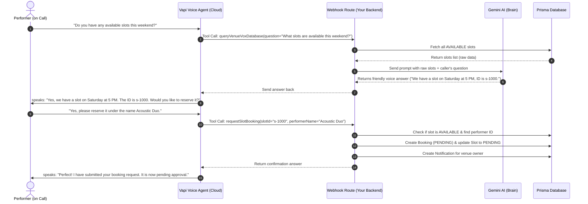

# Vapi Voice Assistant Flow (Searching & Booking)

This document describes how the voice assistant searches for available slots and books them during a live call.

---

## 1. Call Flow Architecture



---

## 2. How Searching Works (`queryVenueVoxDatabase`)

1. **Trigger:** The caller asks a question about dates, times, prices, or venue policies.
2. **Tool Invocation:** The Vapi agent realizes it needs information. It pauses speech and fires the `queryVenueVoxDatabase` function tool with the caller's query (e.g. `question: "Is there anything on Saturday?"`).
3. **Database Pull:** Your backend at `backend/src/routes/webhook.routes.ts` queries Prisma:
   ```typescript
   const availableSlots = await prisma.bookableSlot.findMany({
     where: { status: 'AVAILABLE' },
     include: { venue: { include: { organization: true } } }
   });
   ```
4. **AI Reasoning:** The raw database results and the caller's question are sent to **Gemini**. Gemini filters the dates, matches the request, and formats a natural-sounding response *including the Slot ID* (e.g. `s-1029`).
5. **Speech:** Vapi speaks Gemini's answer to the caller.

---

## 3. How Booking Works (`requestSlotBooking`)

1. **Trigger:** The caller says something like: *"Yes, please book slot s-1029. My name is Acoustic Duo."*
2. **Tool Invocation:** Vapi executes the `requestSlotBooking` tool, extracting:
   - `slotId`: `"s-1029"`
   - `performerName`: `"Acoustic Duo"`
3. **Backend Logic:** Your backend at `backend/src/routes/webhook.routes.ts`:
   - Finds the slot in the database to verify it is still `AVAILABLE`.
   - Searches the `Performer` table to find the matching performer profile for `"Acoustic Duo"`.
   - Creates a new `Booking` row with status `PENDING`.
   - Updates the slot status to `PENDING` and assigns it to that performer.
   - Creates a `Notification` in the database so the venue owner sees the new request in their dashboard.
4. **Speech:** Vapi confirms to the caller: *"Great news! I've submitted your booking request for Saturday. The venue will review it shortly."*

---

## 4. Organization Scoping (Security & Isolation)

To ensure that the voice assistant only accesses and answers questions about slots belonging to **its own organization**, the backend uses query parameter scoping:

1. **Webhook Binding:** When an organization provisions their assistant, their specific `orgId` is appended to the webhook URL:
   `https://your-backend.com/api/v1/voice/webhook?orgId=u-org-1`
2. **Database Query Restriction:** When Vapi triggers a tool-call, the webhook route extracts this `orgId` from the request query. The Prisma lookup is scoped only to venues matching that organization:
   ```typescript
   const availableSlots = await prisma.bookableSlot.findMany({
     where: { 
       status: 'AVAILABLE',
       ...(orgId ? { venue: { organizationId: orgId } } : {}) // Isolated query
     },
     include: { venue: { include: { organization: true } } }
   });
   ```

This prevents callers from retrieving availability details or booking slots belonging to other organizations.

---

## 5. Dynamic Industry Personas

Each type of venue can deploy an assistant tailored to its business model. This is handled dynamically when the assistant is created or updated:

1. **Industry Templates:** Different templates are defined in `backend/src/templates/industries.ts` (e.g., `cafe`, `restaurant`, `bar`, `clubhouse`).
2. **Personality & Rules Injection:** During provisioning, the assistant's specific template capabilities are injected into the system prompt:
   - **Cafe & Coffee Shop:** Handles acoustic/solo artist rules, coffee-shop hours, and acoustic setup policies.
   - **Restaurant & Grill:** Focuses on background music, reservation queries, and full-band rules.
   - **Bar & Lounge:** Manages cover charge inquiries, age restriction (18+/21+) questions, and DJ booking rules.
   - **Clubhouse & Resort:** Focuses on large scale bands, corporate events, and venue rentals.
3. **Voice profile customization:** Different configurations can define distinct voice options or response styles matching the selected industry.

